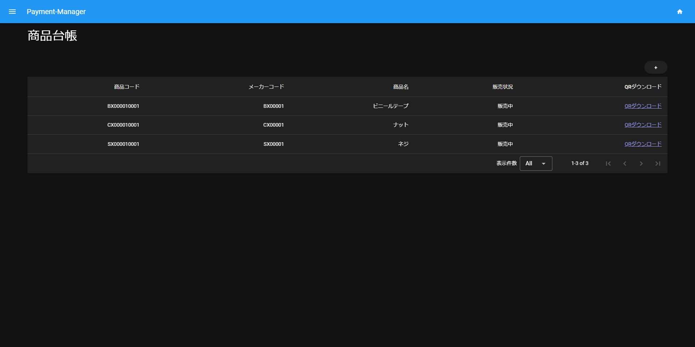
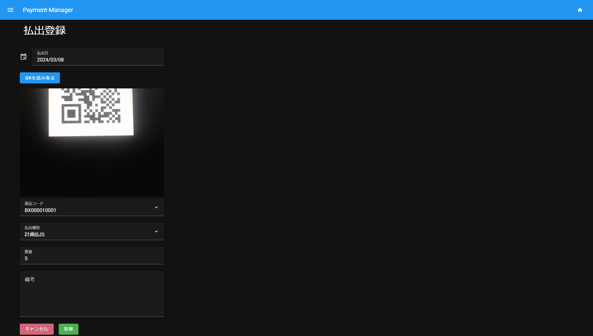

# Payment-Manager

## 商品の払出記録アプリ

- 商品の管理と登録した商品の払出を記録できるアプリ
    - 商品登録時に品番のQRコード生成が可能
      
    - 払出登録時にQRコード読み取りによる品番入力が可能
      

### ディレクトリ構成

```
        |-- application
        |   `-- service　
        |-- domain
        |   |-- model
        |   |-- repository
        |   `-- s3
        |-- infrastructure
        |   |-- database
        |   |   |-- repository
        |   |   `-- table
        |   `-- s3
        `-- presentation
           |-- controller
           `-- form
```
